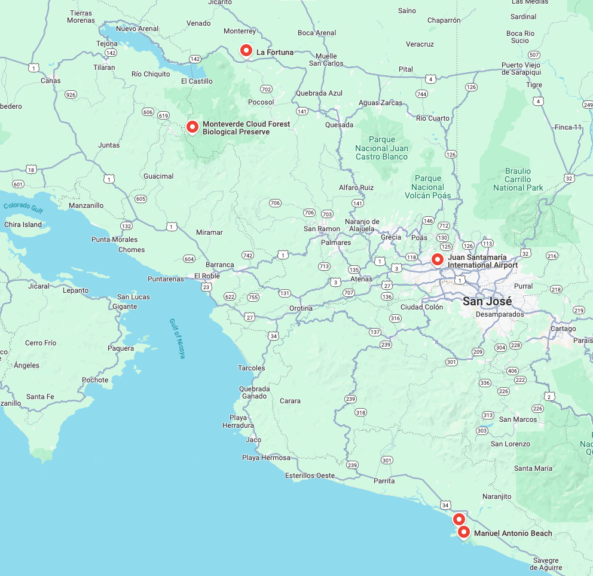

# Costa Rica

March 21st to 28th 2025.

## March 21st

- Fly to San Jose Airport (SJO), Costa Rica
- Departs 9:10
  - AC 34  YVR -> YYZ
  - AC 957 YYZ -> SJO
- Arrives 21:25
- Avis Car pick up at airport 
- Stay at airport hotel in San Jose, Costa Rica

## March 22nd

- [Drive to La Fortuna](https://www.google.ca/maps/dir/Juan+Santamar%C3%ADa+International+Airport,+Alajuela+Province,+R%C3%ADo+Segundo,+Costa+Rica/Alajuela+Province,+La+Fortuna,+Costa+Rica/@10.2438912,-84.5616112,11z/data=!3m1!4b1!4m14!4m13!1m5!1m1!1s0x8fa0f9c450507873:0xb27b62220e3f31a4!2m2!1d-84.2047605!2d9.9981657!1m5!1m1!1s0x8fa00c890660e999:0x69e3a87bd2572ce6!2m2!1d-84.645415!2d10.4711965!3e0?entry=ttu&g_ep=EgoyMDI0MTIxMS4wIKXMDSoASAFQAw%3D%3D) 
  (about 2 1/2 hours)
- Choose one or more adventures (see below)
- Check-in to airbnb

## March 23rd, March 24th

La Fortuna / Monteverde Cloud Forest

Things we could do:

- [Parque Arenal Mundo Aventura (zip line)](https://maps.app.goo.gl/a1HFhWbzMkmxHY4f9)
- [Sky Adventures (zip line)](https://maps.app.goo.gl/UDAQYQydFhusA6WK7)
- [Rainforest Chocolate Tour](https://maps.app.goo.gl/7NumxRmghsB19HFZ7)
- [Mistico Arenal Hanging Bridges](https://maps.app.goo.gl/h7HnAfnVd9xpQWtZA)
- [Arenal Rafting](https://maps.app.goo.gl/BaXgPwSBmAFQvbdR6)
- [Fortuna Waterfall](https://maps.app.goo.gl/5duwahk7b7MECAeUA)
- [Arenal Volcano](https://maps.app.goo.gl/Z5jjPuPp1EL9qeYM7)
- [Monteverde Cloud Forest Biological Preserve](https://maps.app.goo.gl/7XiwVsr1zqXLLtyRA)

## March 25th

- [Drive to Manuel Antonio Area](https://www.google.ca/maps/dir/Alajuela+Province,+La+Fortuna,+Costa+Rica/Puntarenas+Province,+Parrita,+Costa+Rica/@9.9996663,-84.8316769,10z/data=!3m1!4b1!4m14!4m13!1m5!1m1!1s0x8fa00c890660e999:0x69e3a87bd2572ce6!2m2!1d-84.645415!2d10.4711965!1m5!1m1!1s0x8fa1a1c97a54be3b:0x68699d4a0a2777ab!2m2!1d-84.3282606!2d9.5201874!3e0?entry=ttu&g_ep=EgoyMDI0MTIxMS4wIKXMDSoASAFQAw%3D%3D)
  (about 4 hours)

## March 26th

Things we could do:

- [Top things to do in La Fortuna](https://www.viator.com/La-Fortuna/d821)
- [Manuel Antonio National Park](https://www.viator.com/tours/Quepos/Manuel-Antonio-National-Park-PRIVATE-Excursion/d4507-45683P2?mcid=54929&sv1=affiliate&sv_campaign_id=554853&awin_plat_id=11018&awc=11018_1735880896_1c6cde8372cf9d0180cb6d7a1bbf57b4&aid=awinUSDEEPLINK_554853)
- [Playa Las Gemelas Beach](https://maps.app.goo.gl/213y99y8zuBcVawM90)
- [Manuel Antonio Beach](https://maps.app.goo.gl/kquyhJt2fLadJYrNA)
- [Manuel Antonio Zipline](https://maps.app.goo.gl/szjKv7MGUzeg7DdR9)
- [Nauyaca Waterfall](https://maps.app.goo.gl/yiryEvxT5EveNkCq5)
- [Nature Walk](https://www.viator.com/tours/Quepos/Manuel-Antonio-Park-Nature-Guided-Tour/d4507-70025P2)
- [Night Tour](https://www.viator.com/tours/Quepos/Manuel-Antonio-Night-Tour/d4507-117127P3?mcid=54929&sv1=affiliate&sv_campaign_id=554853&awin_plat_id=11018&awc=11018_1735881593_e2dcb5d0c49003e8b1f9578ec2bc43d3&aid=awinUSDEEPLINK_554853)
- [White Water Rafting](https://maps.app.goo.gl/4cyyovwzKS8q4SUT6)
- [Sloth and Monkey Tour](https://www.viator.com/tours/La-Fortuna/Private-Sloth-and-Monkey-Wildlife-Tour/d821-472544P1)

## March 27th

- [Drive to Airport Hotel](https://www.google.ca/maps/dir/Manuel+Antonio,+Puntarenas+Province,+Quepos,+Costa+Rica/Juan+Santamar%C3%ADa+International+Airport,+Alajuela+Province,+R%C3%ADo+Segundo,+Costa+Rica/@9.7072562,-84.4035483,10z/data=!3m1!4b1!4m14!4m13!1m5!1m1!1s0x8fa1717d545f59c7:0x5b06296a6732bace!2m2!1d-84.1553848!2d9.4092624!1m5!1m1!1s0x8fa0f9c450507873:0xb27b62220e3f31a4!2m2!1d-84.2047605!2d9.9981657!3e0?entry=ttu&g_ep=EgoyMDI0MTIxMS4wIKXMDSoASAFQAw%3D%3D)
  (about 3 hours)
- check in to hotel

## March 28th

- Departs 7:55
  - AC 956 SJO -> YYZ
  - AC  33 YYZ -> YVR
- Arrives 20:44

## Reference

- [Kayak Flight Search](https://www.ca.kayak.com/flights/YVR-SJO/2025-03-21/2025-03-28/4adults?ucs=1h32w47&sort=bestflight_a)

- [Ten Day Itinerary](https://haleyblackall.com/10-day-costa-rica-itinerary/)
  - [La Fortuna](https://duckduckgo.com/?t=ffab&q=la+fortuna+costa+rica&atb=v379-1&iax=images&ia=images) is all about nature and wildlife. Waterfalls, hanging bridges, jungle treks, volcanoes, hot springs, sloths, chocolate
  - [Monteverde](https://duckduckgo.com/?q=monte+verde+costa+rica&t=ffab&atb=v379-1&iar=images&iax=images&ia=images) has the Cloud Forest, Zipline, Night Tour, coffee tour
  - [Santa Teresa](https://duckduckgo.com/?q=santa+teresa+costa+rica&t=ffab&atb=v379-1&iar=images&iax=images&ia=images) has beaches, waterfalls, lagoons, bioluminescense (night) tour, snorkeling.
- or
  - [Nosara](https://duckduckgo.com/?q=nosara+costa+rica&t=ffab&atb=v379-1&iar=images&iax=images&ia=images) surfing, sea turtles, beaches.

- [Other places](https://www.laidbacktrip.com/posts/costa-rica-best-places-to-visit)
  - [Corcovado National Park](https://en.wikipedia.org/wiki/Corcovado_National_Park)
  - [Rio Celeste](https://costaricatravellife.com/rio-celeste-costa-rica/)

- [Seven Day Itinerary](https://shesavesshetravels.com/travel-destinations/7-days-costa-rica-itinerary/)
  - Similar to 10 day trip above, but alternately: [Manual Antonio](https://shesavesshetravels.com/travel-destinations/things-to-do-in-manuel-antonio/) has [the park](https://www.viator.com/tours/Quepos/Manuel-Antonio-National-Park-PRIVATE-Excursion/d4507-45683P2?mcid=54929&sv1=affiliate&sv_campaign_id=554853&awin_plat_id=11018&awc=11018_1734827555_b735d562fec5a1dd72d5751b358c2a66&aid=awinUSDEEPLINK_554853), snorkeling, zipline, kayaking, beaches, waterfalls, night tour, ATV tour, bird watching, white water rafting, sky diving, sloths.