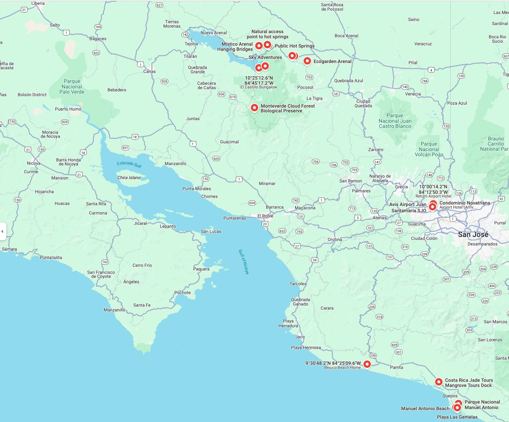

# Costa Rica

March 21st to 28th 2025.

## Fly to San Jose Airport

Departs 9:10

- AC 34  YVR -> YYZ
- AC 957 YYZ -> SJO

Arrives 21:25

Avis Car pick up at airport

## La Fortuna and Monteverde Cloud Forest

## Manuel Antonio Beach and Manuel Antonio National Park

## Manuel Antonio to San Jose

## Fly to Vancouver

Departs 7:55

- AC 956 SJO -> YYZ
- AC  33 YYZ -> YVR

Arrives 20:44

## Reference

- [Kayak Flight Search](https://www.ca.kayak.com/flights/YVR-SJO/2025-03-21/2025-03-28/4adults?ucs=1h32w47&sort=bestflight_a)

- [Ten Day Itinerary](https://haleyblackall.com/10-day-costa-rica-itinerary/)
  - [La Fortuna](https://duckduckgo.com/?t=ffab&q=la+fortuna+costa+rica&atb=v379-1&iax=images&ia=images) is all about nature and wildlife. Waterfalls, hanging bridges, jungle treks, volcanoes, hot springs, sloths, chocolate
  - [Monteverde](https://duckduckgo.com/?q=monte+verde+costa+rica&t=ffab&atb=v379-1&iar=images&iax=images&ia=images) has the Cloud Forest, Zipline, Night Tour, coffee tour
  - [Santa Teresa](https://duckduckgo.com/?q=santa+teresa+costa+rica&t=ffab&atb=v379-1&iar=images&iax=images&ia=images) has beaches, waterfalls, lagoons, bioluminescense (night) tour, snorkeling.
- or
  - [Nosara](https://duckduckgo.com/?q=nosara+costa+rica&t=ffab&atb=v379-1&iar=images&iax=images&ia=images) surfing, sea turtles, beaches.

- [Other places](https://www.laidbacktrip.com/posts/costa-rica-best-places-to-visit)
  - [Corcovado National Park](https://en.wikipedia.org/wiki/Corcovado_National_Park)
  - [Rio Celeste](https://costaricatravellife.com/rio-celeste-costa-rica/)

- [Seven Day Itinerary](https://shesavesshetravels.com/travel-destinations/7-days-costa-rica-itinerary/)
  - Similar to 10 day trip above, but alternately: [Manual Antonio](https://shesavesshetravels.com/travel-destinations/things-to-do-in-manuel-antonio/) has [the park](https://www.viator.com/tours/Quepos/Manuel-Antonio-National-Park-PRIVATE-Excursion/d4507-45683P2?mcid=54929&sv1=affiliate&sv_campaign_id=554853&awin_plat_id=11018&awc=11018_1734827555_b735d562fec5a1dd72d5751b358c2a66&aid=awinUSDEEPLINK_554853), snorkeling, zipline, kayaking, beaches, waterfalls, night tour, ATV tour, bird watching, white water rafting, sky diving, sloths.